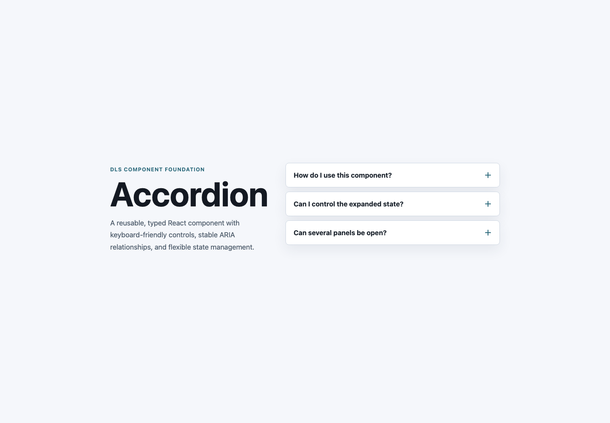
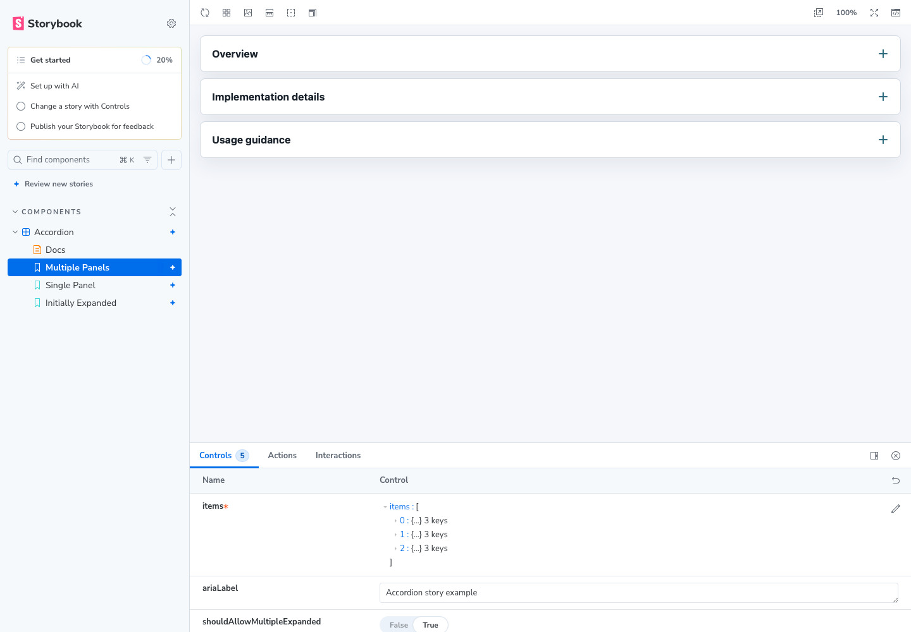

# DLS Accordion Library

A compact React and TypeScript component-library foundation built around an accessible Accordion component. The project is intentionally small enough to review quickly while still covering the baseline ergonomics a reusable UI package needs: typed source, tests, linting, formatting, library builds, and a rendered demo.

## Stack Choices

- **React + TypeScript**: common in design-system work, with strong prop contracts for consuming teams.
- **Vite**: fast local development and straightforward library-mode output.
- **Vitest + React Testing Library**: browser-like tests with user-event interactions that match how the component is consumed.
- **Storybook**: documents component states in isolation and gives designers/engineers a shared review surface.
- **ESLint + Prettier**: separated code-quality and formatting concerns so future contributors get predictable feedback.
- **Vite library mode**: uses Rollup internally to produce ESM and UMD bundles plus generated TypeScript declarations.
- **CSS alongside the component**: keeps the package dependency-light while leaving room to move to tokens or CSS modules later.

## Getting Started

```bash
npm install
npm run dev
```

The demo renders at the local Vite URL printed in the terminal.

## Local Preview

Vite demo:



Storybook component review:



## Useful Scripts

```bash
npm run test
npm run lint
npm run format
npm run build
npm run storybook
npm run build:storybook
```

## Component API

```tsx
import { Accordion } from 'dls-accordion-library';

<Accordion
  items={[
    { id: 'first', title: 'Panel one', content: 'Content for panel one' },
    { id: 'second', title: 'Panel two', content: 'Content for panel two' },
  ]}
/>;
```

### Accordion Props

| Prop                          | Type                      | Default     | Purpose                                                      |
| ----------------------------- | ------------------------- | ----------- | ------------------------------------------------------------ |
| `items`                       | `AccordionItem[]`         | required    | Panels to render.                                            |
| `shouldAllowMultipleExpanded` | `boolean`                 | `true`      | Allows more than one panel to stay open.                     |
| `defaultExpandedIds`          | `string[]`                | `[]`        | Initial state for uncontrolled usage.                        |
| `expandedIds`                 | `string[]`                | `undefined` | Enables controlled usage.                                    |
| `onExpandedChange`            | `(ids: string[]) => void` | `undefined` | Reports state changes.                                       |
| `className`                   | `string`                  | `undefined` | Adds a class to the root element.                            |
| `ariaLabel`                   | `string`                  | `undefined` | Labels the accordion group when there is no visible heading. |

## Accessibility Notes

Each trigger is a real `button` with `aria-expanded` and `aria-controls`. Each panel region has `aria-labelledby` pointing back to its trigger. Collapsed regions stay mounted and hidden so the ARIA relationship remains valid, while the panel body content is only rendered while expanded. Tests cover pointer interaction, keyboard activation, tab order, and the ARIA relationships from trigger to region.

## Distribution Notes

The package is configured with `main`, `module`, `types`, and `exports` entries so consumers can import the compiled component from the package root. `prepublishOnly` runs linting, tests, and the production build before a publish attempt. The package is not published as part of this assessment, but the repository is ready for that workflow.

## Future Improvements

- Add a CI workflow that runs install, lint, test, and build on pull requests.
- Publish generated API documentation from TypeScript types.
- Introduce design tokens for spacing, color, border, and motion values.
- Add package publishing automation with changesets once there are multiple components.
- Add axe-powered accessibility checks to supplement the existing semantic tests.
